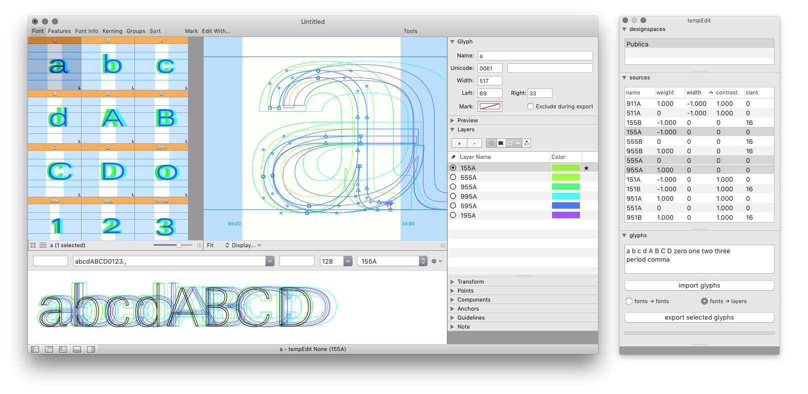
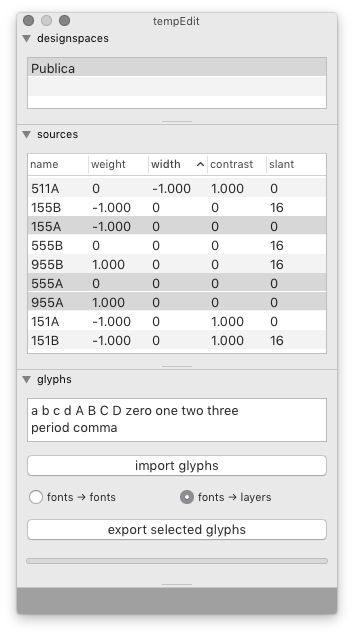
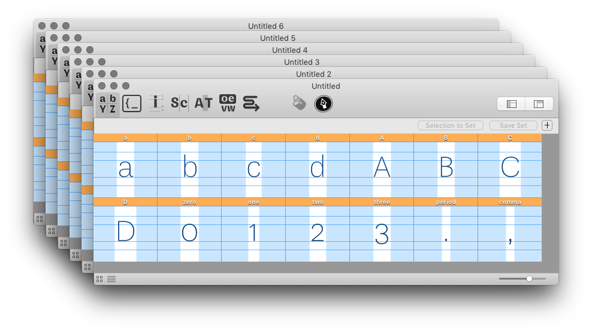
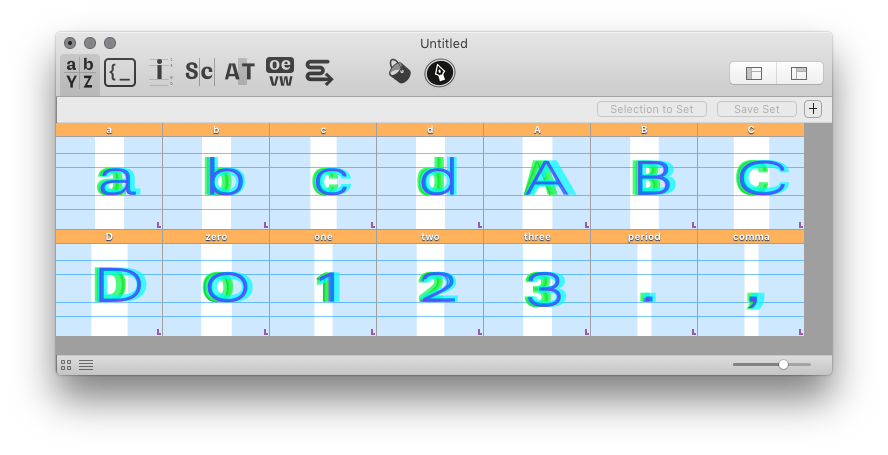

TempEdit
========

TempEdit is a RoboFont extension to import glyphs from multiple designspace sources into temporary font(s) for editing, and save them back into their source UFOs after the edits are done.

Context
-------

Working with large designspaces with many masters can be challenging: loading too many large fonts can make the application slower, and it gets hard to jump between glyphs from different masters.

TempEdit offers a method to edit glyphs from multiple masters without having to load the full fonts which contain them. The glyphs are imported into one or more temporary font(s) for editing, and are saved back into their source UFOs when editing is over. The multiple source glyphs can be imported as layers of a single font, or as separate fonts.

- see also: [What computer performance metrics are most relevant to RF performance?](http://forum.robofont.com/topic/672/what-computer-performance-metrics-are-most-relevant-to-rf-performance)

How to use the tool
-------------------

0. Open the TempEdit window from the *Extensions* menu.

    

1. Drag and drop one or more `.designspace` files from Finder into the *designspaces* list.

2. Select a designspace in the top list to load all its sources into the second list.

3. Define which glyphs will be imported for editing, as a list of glyph names.

4. Choose how the source glyphs will be imported:

    Select *fonts → fonts* to import each source into a separate font: 

    

    Select *fonts → layers* to import sources as layers of a single font:

    

5. Click on the *import* button to import glyphs into a temporary font.

6. Make changes, then use the *export* button to save the selected glyphs back into their source fonts.

Implementation details
----------------------

When a glyph is imported from a UFO source into a temporary font, the path of the source glyphset is stored in the glyph lib. This way, the glyph can find its way back to its source font when it is exported.
