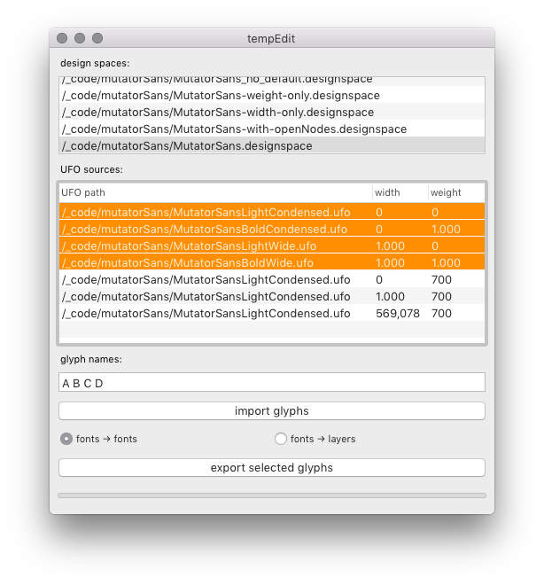
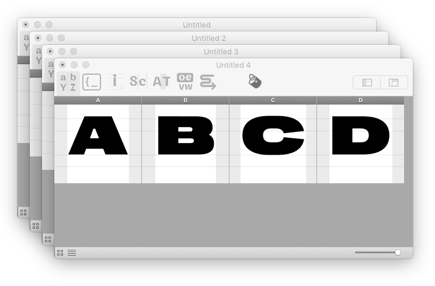

tempEdit
========

A tool for importing glyphs from `.designspace` sources into a temporary font for editing, and saving them back into their source UFOs when done.

Problem
-------

- dealing with large designspaces containing several masters
- each master contains hundreds of glyphs each
- need to have several masters open at once in the 
UI for editing
- refreshing the Font Collection is a performance bottleneck, RF becomes slower

see [What computer performance metrics are most relevant to RF performance?](http://forum.robofont.com/topic/672/what-computer-performance-metrics-are-most-relevant-to-rf-performance)

Solution
--------

- avoid opening several large fonts in the UI!
- treat full UFOs as a “database”, work with partial fonts instead
- open only glyphs that need to be edited in the UI using temporary fonts
- after the glyphs have been edited, save them back into their source fonts

Usage
-----

1. Drag and drop one or more `.designspace` files from Finder into the *designspaces* list (top).

2. Select a designspace file to refresh the *UFO sources* list with all masters used in the designspace.

3. Define a list with names of glyphs you wish to import for editing.

4. Click on the *import* button to import glyphs into a temporary font.

    Choose *fonts → fonts* to import each source into a separate font: 

    

    Choose *fonts → layers* to import sources as layers of a single font:

    

5. Make changes, then use the *export* button to save the selected glyphs back into their source fonts.

Implementation
--------------

When a glyph is imported from a UFO source into a temporary font, the path of the source glyphset is stored in the glyph lib. This way, the glyph can find its way back to its source font when it is exported.